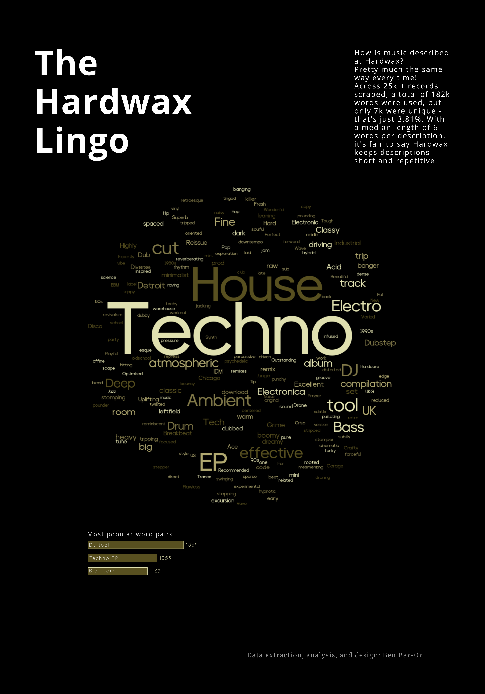

# Hardwax Record Descriptions Analysis 🎵📊

**tl;dr:** Scraped and analyzed **25K+ records** from Hardwax to explore the language of electronic music descriptions, and trends. This project demonstrates a full end-to-end workflow: **scraping, processing, cleaning, analyzing, visualizing, and designing** the final charts.

---

## 📊 Visualisations

---

## 🛠 End-to-End Workflow

### Data extraction / scraping
- Identified Hardwax’s **backend API endpoints** to handle lazy-loaded content.  
- Iterated over JSON responses to collect all record IDs (slugs).  
- Queried each slug to fetch a JSON containing the HTML content for the record.  
- Parsed the HTML to extract full record descriptions.  

### Data cleaning & processing
- Cleaned and standardized descriptions in **Jupyter Notebook**.  
- Used **Pandas**, **spaCy**, and **Textacy** for text preprocessing and lemmatization.  

### Data analysis
- Explored trends and common words across all records.  

### Visualization
- Created charts using **Matplotlib** and **Seaborn**.  
- Exported visuals as **SVGs** and finalized the design in **Inkscape**.  

---
## 📂 Explore the project
Check out the Jupyter Notebook for full workflow and insights:  
[hardwax_descriptions_analysis.ipynb](hardwax/hardwax_descriptions_analysis.ipynb)  

---

## 💡 Key learnings / what I practiced
- Scraping data behind **lazy-loading pages** via JSON API endpoints.  
- Parsing HTML content programmatically and handling text extraction at scale.  
- Text cleaning and NLP preprocessing with **Pandas**, **spaCy**, and **Textacy**.  
- End-to-end **data pipeline from raw web data to polished visualization**.  
- Combining Python visualizations with manual design enhancements in **Inkscape**.  

